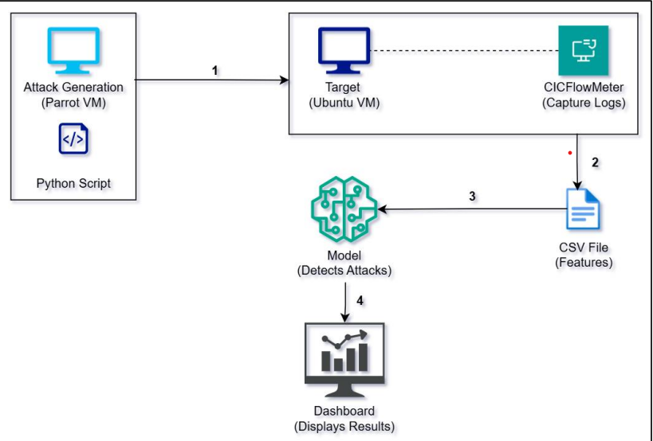

# Multi-Class DDoS Detection Using LSTM Autoencoder and DNN

## Overview

This project presents a complete pipeline for real-time detection and classification of Distributed Denial of Service (DDoS) attacks. It leverages deep learning techniques, combining an LSTM Autoencoder for anomaly detection and a DNN for multi-class attack classification. The solution is based on realistic traffic data and supports real-time deployment scenarios.


<!--  -->
---

## Key Features

- **Traffic Simulation**: Simulates various DDoS attack types in a virtualized environment.
- **Traffic Capture**: Utilizes CICFlowMeter for feature extraction from raw network traffic.
- **Two-Phase Detection**:
  - **Phase 1**: LSTM Autoencoder trained on normal traffic to detect anomalies.
  - **Phase 2**: Deep Neural Network (DNN) classifier to identify specific attack types.
- **Real-time Dashboard**: Provides visualizations of traffic patterns, anomalies, and predicted attack classes.
- **Low Latency**: Inference time ~0.28 ms/sample, suitable for high-throughput environments.

---

## Attack Types Covered

The system supports classification of various attack types across different layers:

- **TCP-based Reflection Attacks**: MSSQL
- **UDP/TCP Reflection Attacks**: DNS, PORTMAP, LDAP, NetBIOS, SNMP
- **UDP-based Reflection Attacks**: TFTP, NTP, CharGen
- **TCP Exploitation Attacks**: SYN Flood
- **UDP Exploitation Attacks**: UDP Flood, UDP-Lag


---

## Dataset

The system is built on the [CIC-DDoS2019](https://www.kaggle.com/datasets/dhoogla/cicddos2019) dataset, which includes labeled flows for a wide range of real-world attack scenarios.

---

## Project Objectives

- Implement an LSTM Autoencoder to detect anomalous network behavior.
- Integrate a DNN classifier for attack-type recognition.
- Minimize false positives and maximize generalization across attack types.
- Support real-time, low-latency detection.
- Enable visualization for practical use in enterprise and academic research environments.

---

## Screenshots


### Real Time Detection Dashboard


The dashboard visualizes network anomaly detection results. It showcases distribution of various DDoS attack types and the proportion of anomalous versus benign traffic. Use also can see the detailed records, enabling effective real-time monitoring and classification of network threats for cybersecurity analysis

---

## Project setup

1. Clone the repository:
   ```bash
   git clone https://github.com/yourusername/multiclass-ddos-detector.git
   cd multiclass-ddos-detector

2. Move Files to Respective Virtual Machines (VMs)

3. Ensure that Parrot os and target machine/s are on the same network


## How to run

1. Execute the attck script from Parrot OS
  ```
  sudo python3 DDoS_sim.py -i <low/medium/high> -s -p <target port> <target IP> -d <attack_duration>```

2. Run CICFlowMeter on Ubuntu
  ```
  sudo bash run_cicflowmeter.sh
  ```

3. Send the generated CSV file to the host machine
  ```
  sudo bash send_flow_file.sh
```
- choose the file
- enter IP address of host

4. Receive File → Run Detection Model → Launch Dashboard
  ```
  python .\ddos_manager.py
  ```


